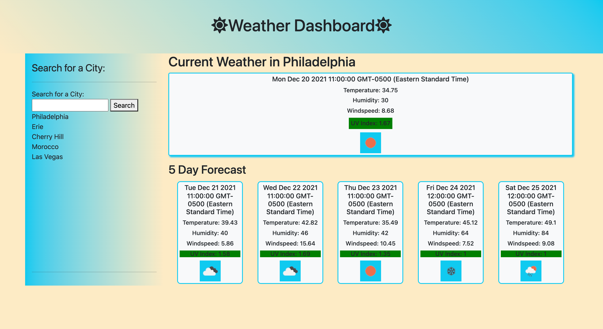

# weather-dashboard
## Description
This project was motivated by learning how to fetch data from the OpenWeatherMap API and use it to look up weather for each city a user searches. I built this project so I could practice using Server Side APIs and get familiar with manipulating the data. The project is for a user that wishes to lookup the current and forecasted weather for the city they searched for. In addition, the searches are stored in the user's local storage and can be retrieved when the user clicks on the search history. This project taught me how to fetch data from an API and use the data to display information when requested by the user. I further developed my skills in the CSS Framework, Bootstrap, as well.
## Installation
[Link to Dashboard](https://tinastanczyk.github.io/weather-dashboard/)
## Usage

## Credits
OpenWeatherMap API
## License
[Link to License](LICENSE)
---